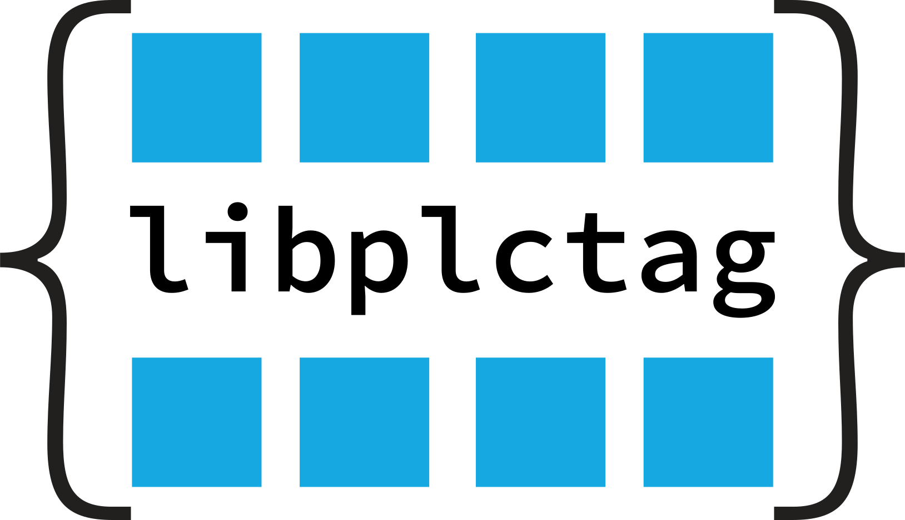

# libplctag.NET

[libplctag](https://github.com/libplctag/libplctag) is an open source C library for Linux, Windows and macOS using EtherNet/IP or Modbus TCP to read and write tags in PLCs.

libplctag.NET provides .NET wrapper packages for libplctag, and publishes them to Nuget.org.

## [libplctag](https://www.nuget.org/packages/libplctag/)  

This is the package intended for use in .NET applications.
It provides an API for libplctag that should feel natural to .NET developers by supporting the following features:
* Values are strongly-typed (both Atomic types and User-Defined Types).
* Errors are thrown as Exceptions
* Async/Await
* Native resource cleanup

See [examples](examples/) and [the docs](docs/libplctag.md#getting-started) for more information.

## [libplctag.NativeImport](https://www.nuget.org/packages/libplctag.NativeImport/)  

This package provides low-level (raw) access to the libplctag core library which is written in C.
The purpose of this package is to expose the API for this library to .NET applications, and handle platform and configuration issues.

Application developers typically won't need to reference this package directly; it is primarily for use in other wrapper libraries.

See [here](docs/libplctag.NativeImport.md) for more information.

## Getting Help

* [libplctag Wiki](https://github.com/libplctag/libplctag/wiki)
* [libplctag.NET docs](docs)
* [Contributing](CONTRIBUTING.md)
* [Reporting an issue](CONTRIBUTING.md#reporting-bugs)

libplctag.NET is part of the libplctag organization, so the [same policies apply](https://github.com/libplctag/libplctag#contact-and-support).
